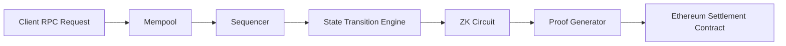

# Atlas ZK Rollup

A modular zero-knowledge rollup prototype built in Rust using Halo2, async proving infrastructure, Ethereum settlement, and a high-performance concurrent sequencer.

This repository demonstrates production-style protocol engineering concepts including:

* ZK proof generation with Halo2
* Concurrent batch proving using Tokio + Rayon
* Rollup state transitions
* Ethereum settlement integration
* Async RPC infrastructure
* Persistent state storage using RocksDB
* Rust monorepo architecture
* Ethereum smart contract integration

---

# Why This Matters

Modern blockchains face a fundamental scalability problem.

Ethereum provides strong decentralization and security, but every transaction executed directly on Ethereum is expensive.

ZK rollups solve this problem by:

1. Executing transactions off-chain
2. Compressing execution into cryptographic proofs
3. Publishing only compressed state commitments to Ethereum
4. Allowing Ethereum to verify correctness without re-executing every transaction

This project implements a simplified but architecturally realistic zk-rollup pipeline.

---

# High-Level Architecture



---

# System Components

## Sequencer

The sequencer:

* accepts transactions
* batches transactions
* computes state transitions
* generates state roots
* submits batches to Ethereum

Implemented in:

```text
crates/sequencer
```

---

## Prover

The prover:

* generates Halo2 zero-knowledge proofs
* validates circuit constraints
* serializes proof artifacts
* benchmarks proving performance

Implemented in:

```text
crates/prover
```

---

## Solidity Verifier

The Ethereum verifier contract:

* accepts rollup settlements
* stores state roots
* prevents replay attacks
* emits settlement events

Implemented in:

```text
crates/contracts
```

---

## RPC Layer

The RPC layer exposes:

* transaction submission
* health endpoints
* external node interaction

Implemented using:

* Axum
* Tokio
* async Rust runtime

---

# Repository Structure

```text
atlas-zk-rollup/
│
├── crates/
│   ├── prover/
│   │   ├── benches/
│   │   ├── examples/
│   │   └── src/
│   │
│   ├── sequencer/
│   │   └── src/
│   │
│   ├── primitives/
│   │   └── src/
│   │
│   ├── contracts/
│   │   ├── src/
│   │   ├── script/
│   │   └── test/
│   │
│   └── node/
│
├── Cargo.toml
├── Cargo.lock
├── README.md
└── .gitignore
```

---

# Core Technologies

| Technology | Purpose                     |
| ---------- | --------------------------- |
| Rust       | Systems programming         |
| Tokio      | Async runtime               |
| Rayon      | Parallel proof generation   |
| Halo2      | ZK proving system           |
| Ethereum   | Settlement layer            |
| Axum       | RPC server                  |
| RocksDB    | Persistent state storage    |
| Foundry    | Solidity deployment/testing |
| Blake3     | Fast hashing                |

---

# Rollup Lifecycle

## 1. Transaction Submission

Clients submit transactions through the JSON-RPC API.

Example:

```bash
curl -X POST http://127.0.0.1:3000/tx \
-H "Content-Type: application/json" \
-d '{
  "from": [1,1,1,1,1,1,1,1,1,1,1,1,1,1,1,1,1,1,1,1,1,1,1,1,1,1,1,1,1,1,1,1],
  "to": [2,2,2,2,2,2,2,2,2,2,2,2,2,2,2,2,2,2,2,2,2,2,2,2,2,2,2,2,2,2,2,2],
  "amount": 100,
  "nonce": 1
}'
```

---

## 2. Mempool Ingestion

Transactions enter a concurrent mempool implemented using:

* DashMap
* Arc shared ownership
* Tokio async tasks

---

## 3. Batch Creation

The sequencer groups transactions into batches.

Each batch computes:

* previous state root
* new state root
* batch hash

---

## 4. ZK Proof Generation

Halo2 circuits validate:

* commitment constraints
* nullifier constraints
* transaction correctness

Proofs are serialized into transcript bytes and prepared for settlement.

---

## 5. Ethereum Settlement

The sequencer:

* signs Ethereum transactions
* submits batch commitments
* updates settlement contract state

---

# ZK Circuit Design

The project includes a simplified privacy-oriented circuit.

Circuit constraints:

```text
commitment = owner + amount + secret
nullifier = secret²
```

The circuit demonstrates:

* witness assignment
* advice columns
* selectors
* constraint systems
* proving/verification keys

---

# Concurrency Model

The proving infrastructure demonstrates multiple concurrency models.

## Tokio

Tokio is used for:

* async RPC handling
* Ethereum submission
* networking
* task orchestration

## Rayon

Rayon is used for:

* parallel proof generation
* concurrent batch computation
* CPU-bound proving workloads

---

# Persistence Layer

Persistent storage uses RocksDB.

Stored artifacts:

* batches
* state roots
* settlement metadata

Benefits:

* durable state
* crash recovery
* replay protection
* deterministic persistence

---

# Replay Protection

Each batch computes a deterministic cryptographic hash using:

* batch ID
* previous state root
* new state root
* transaction hashes

This prevents duplicate settlement submission.

---

# Performance Benchmarks

Criterion benchmarks are included for:

* proving latency
* transaction throughput
* batch proving performance

Example benchmark:

```text
prove_100_txs time:
304µs - 312µs
```

---

# Running the Project

## Requirements

* Rust stable
* Cargo
* Foundry
* LLVM/Clang
* Sepolia ETH

---

# Install Rust

```bash
curl --proto '=https' --tlsv1.2 -sSf https://sh.rustup.rs | sh
```

---

# Install Foundry

```bash
curl -L https://foundry.paradigm.xyz | bash
foundryup
```

---

# Environment Variables

Create:

```text
.env
```

Example:

```env
SEPOLIA_RPC_URL=https://eth-sepolia.g.alchemy.com/v2/your_key
PRIVATE_KEY=0xyour_private_key
CONTRACT_ADDRESS=0xyour_contract
```

---

# Build

```bash
cargo build
```

---

# Run Tests

```bash
cargo test
```

---

# Run Benchmarks

```bash
cargo bench -p prover
```

---

# Run Sequencer

```bash
cargo run -p sequencer
```

---

# Docker Deployment

Build and run locally:

```bash
docker compose up --build
```

---

# Start RPC Node

RPC server:

```text
127.0.0.1:3000
```

Health endpoint:

```bash
curl http://127.0.0.1:3000/health
```

---

# Deploy Contracts

```bash
forge script script/Deploy.s.sol:Deploy \
--rpc-url $SEPOLIA_RPC_URL \
--broadcast
```

---

# Example Settlement Output

```text
created batch 1 with 25 txs
new state root: [...]
batch submitted to Ethereum
```

---

# Rust Systems Engineering Concepts Demonstrated

## Ownership and Lifetimes

The project uses Rust ownership semantics to:

* prevent memory corruption
* avoid data races
* safely share concurrent state

Examples:

* Arc shared ownership
* async task movement
* zero-copy references

---

## Async Infrastructure

Tokio powers:

* concurrent RPC services
* Ethereum transaction submission
* network orchestration

This models real blockchain node architecture.

---

## Zero-Copy Design

Performance-sensitive components avoid unnecessary allocations where possible.

Examples:

* byte slice hashing
* transcript serialization
* deterministic hashing

---

## Deterministic State Transitions

State roots are generated deterministically from:

* ordered transactions
* prior state
* cryptographic hashing

This is foundational for blockchain correctness.

---

# Security Considerations

Current implementation is educational/prototype-grade.

Simplifications include:

* simplified verifier logic
* simplified arithmetic commitment scheme
* no recursive proofs
* no decentralized sequencing
* no fraud-proof fallback

Future production improvements:

* Poseidon hashing
* recursive proving
* proof aggregation
* decentralized sequencing
* DA layer integration
* recursive verifier contracts

---

# Future Improvements

* Real Halo2 verifier integration
* Recursive proofs
* GPU proving
* Distributed sequencer consensus
* Data availability layer
* Recursive aggregation
* Optimistic fallback proofs
* State trie implementation

---

# Engineering Goals

This project was designed to demonstrate:

* protocol engineering
* systems programming
* async Rust infrastructure
* ZK proving systems
* Ethereum settlement architecture
* blockchain state management
* concurrency engineering
* production-oriented repository structure

---

# License

MIT License
